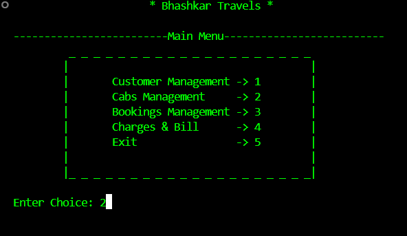
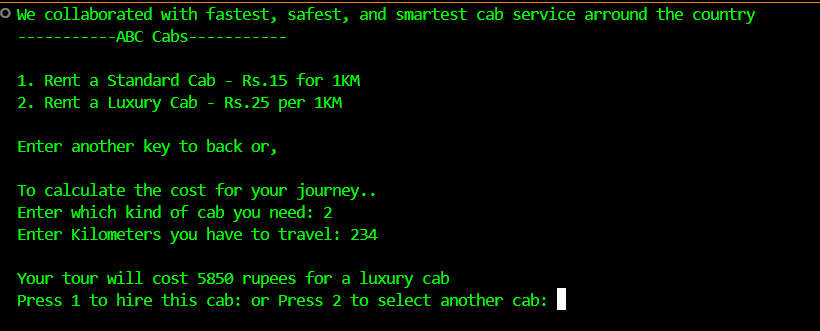

# 🚌 Travel Management System

A simple **C++ console-based Travel Management System** to handle customer details, cab bookings, hotel charges, and billing.  
This project is designed for beginners in C++ to practice **OOP concepts**, **file handling**, and **menu-driven programs**.

---

## ✨ Features

- **Customer Management** – Store and manage customer details.
- **Cab Management** – Select between Standard or Luxury cabs with cost calculation.
- **Bookings Management** – Manage travel and hotel bookings.
- **Charges & Bill** – Automatically generate receipts with travel and hotel costs.
- **Menu-Driven Interface** – Easy-to-use text-based navigation.

---

## 📸 Screenshots

### **Main Menu**

### **Cab Selection & Fare Calculation**

### **Generated Receipt**

---

## 🛠️ Technologies Used

- **Language:** C++
- **Concepts:** Object-Oriented Programming, File Handling, Loops, Conditional Statements

---

   git clone https://github.com/YOUR_USERNAME/Travel_Management_System.git
